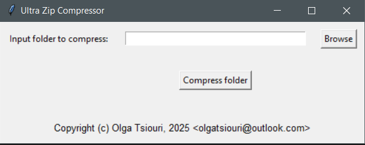

# Ultra Zip Compressor
Windows x86_64 GUI WinRAR wrapper to ultra compress a folder to a zip archive
## Installation
- Install [WinRAR](https://www.win-rar.com/fileadmin/winrar-versions/winrar/winrar-x64-713.exe).
- Open the installer, select and make note of the folder destination you will install WinRAR. Leave the rest of installation options as default.
- Right click the start button and select System -> Advanced system settings -> Enviromental Variables
- In the User enviromental variables panel create or edit an anenviromental variable named Path and add the folder destination where you installed  WinRAR.  
- After doing that click `OK` on all windows.
- Download the file from this repository's `bin` folder
## Usage

- Browse or paste the destination to the input folder.
- Click `Compress folder`.

**Note: input data used are derived from solgenomics.net**
